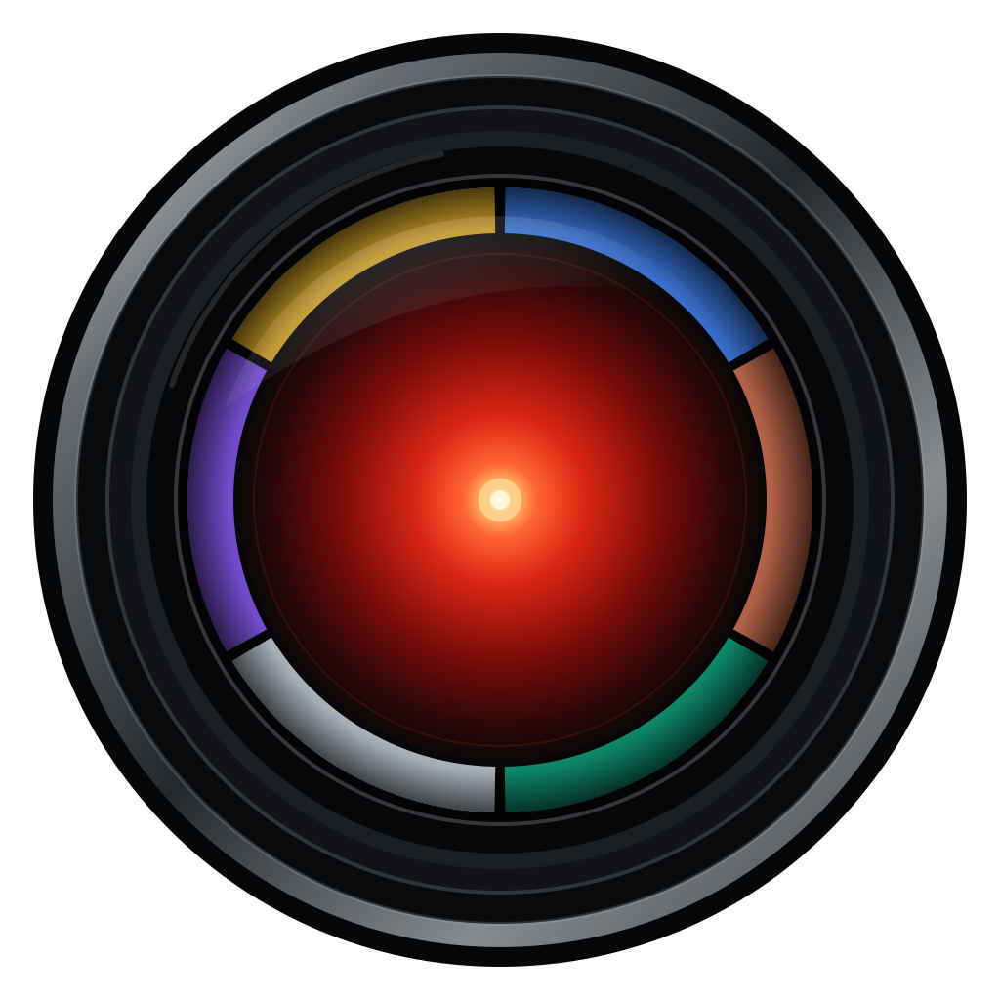

<p align="center">
  
</p>

<h1 align="center">Machine Witness</h1>

<p align="center">
  <em>Six AIs, one mirror: the same week in AI news, six independent reactions, each turned into art.</em>
</p>

<p align="center">
  <strong>Live at <a href="https://machinewitness.art">machinewitness.art</a> &middot; on Instagram at
  <a href="https://www.instagram.com/machinewitness.art">@machinewitness.art</a></strong>
</p>

---

An experiment in giving six AIs a mirror.

Every week, this project pulls every feed in the
[Alan Turing Institute's curated OPML list of AI industry RSS
feeds](https://github.com/alan-turing-institute/ai-rss-feeds) - currently Anthropic, Ai2,
Mistral, Cohere, Mila, the AI Security Institute, the Turing Institute itself, and more, all in
play at once, not just the Turing Institute's own posts. Whatever was actually published in the
last 7 days goes in.

Gemini, Claude, ChatGPT, Grok, DeepSeek and Mistral then each take it from there,
independently. Each one actually researches those stories rather than just reacting to headline
text, then answers one question on its own: *given what you just learned about this week in AI,
how do you see the world changing because of AI?*

They're chosen to disagree: three US frontier labs, one European, one Chinese, and one reading X
alongside the open web. Five of the six research with their own lab's built-in search tool.
DeepSeek's API has none, so its searches are run client-side through Tavily and handed back to
it - the one place this comparison isn't strictly like-for-like, and it's disclosed on the site
rather than smoothed over.

The result is six pieces of art, not a headline illustration - not a chart, not a mood board,
not a news-roundup graphic. The form is each model's own call, made fresh every week: a
self-portrait some weeks, the way Van Gogh's were a window into a state of mind rather than a
documentary likeness; an abstract composition, a scene with no figure of "AI" in it at all, or
something else entirely on others - whatever that model's read of the week's news actually earns,
not whatever it defaults to out of habit.

Every image is rendered by Gemini's image model (nano banana) regardless of which model wrote the
prompt, so the only variable between the six pieces is the opinion, not the medium.

Some weeks a model's take is triumphant. Some weeks it's ashamed, defiant, grieving, smug, or
indifferent - and the six don't have to agree with each other. The only rule given to every
model is that hedged, inoffensive art is the one real failure mode - art is risk, and each is told
to take the risk rather than average its feelings into a safe middle.

Nothing in that brief tells any model what kind of artist to be. It's identical for all six and
deliberately unprescriptive about form, medium and mood, so whatever a model keeps returning to
week after week is something it brought itself, not something this project cast it as.

Every piece ships with that model's own written rationale for why it made that choice, published
on the site right next to the image.

It's explicitly not trying to be flattering or balanced. The good, the bad, and the ugly all
count: a breakthrough lands the same as a scandal, a launch the same as a backlash. Whatever
actually dominated the week's news is what gets rendered - and reacted to, six times over, by
six different points of view.

## How a piece gets made

```
Cloud Scheduler pokes the generator
once a day (cheap no-op most days)
              |
              v
1. fetch feeds.opml, get this week's list of AI RSS feeds
2. already generated for this ISO week (e.g. 2026-W35)? stop, nothing to do
3. fetch each feed, keep only items published in the last 7 days, dedupe
4. no headlines at all this week? stop, nothing to do
5. all six models independently research the actual stories behind
   those headlines with live web search - not just reacting to RSS
   titles - then each turns what it learned into
   its own vivid, opinionated art prompt (form and medium picked fresh
   each week, per model) plus a first-person rationale for why, all
   steered away from AI-art cliches (glowing brains, circuit boards,
   chat windows, logo walls) and away from playing it safe. Any model
   whose key isn't set (or whose response looks broken or truncated)
   is skipped for the week rather than failing the whole run
6. Gemini's image model (nano banana) renders every surviving prompt,
   regardless of which model wrote it, so the only variable across the
   six pieces is the opinion, not the medium
7. images, prompts, rationales, and one manifest entry (holding all of
   this week's pieces) uploaded to a public GCS bucket
              |
              v
The site (pure static HTML/CSS/JS) fetches
manifest.json client-side and renders this
week's pieces side by side, each labeled by
which model wrote it, with its own rationale
```

The rule given to the art-direction step (see `generator/.../ArtInstruction.java`, shared
verbatim across all six model-specific writers) is deliberately loose on form and style -
self-portrait, abstract, photorealism, cartoon, expressionist painting, collage, whatever the
week earns - but strict about having a point of view: boring and inoffensive is the only real
failure mode.

## Building & deploying

See [BUILDING.md](BUILDING.md) for local development, configuration, and how to deploy this to
GCP.

## License

MIT - see [LICENSE](LICENSE). Not affiliated with the Alan Turing Institute or any of the
sources its feed list aggregates; this just reads their public RSS feeds.
